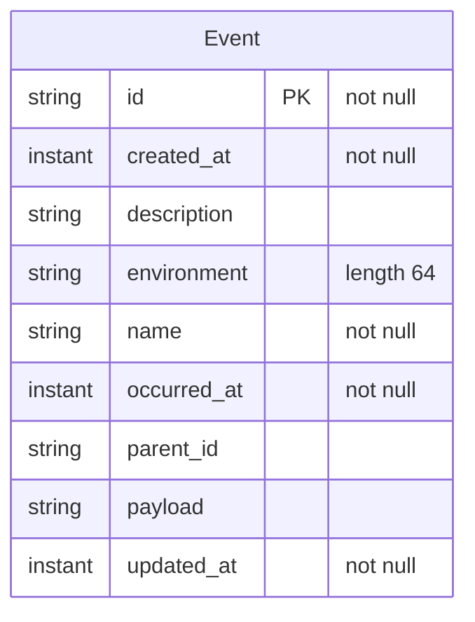

<!-- Generated by `qits database diagram` (jpa). Do not edit: the entity-diagram automation rewrites this file on every release request fold. -->
# Persistence unit `events`

Datasource `events` · package `eu.wohlben.qits.events.entity` · 1 entity

